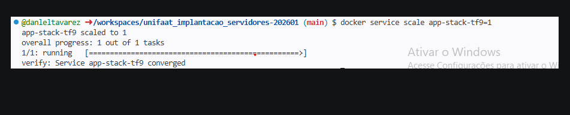
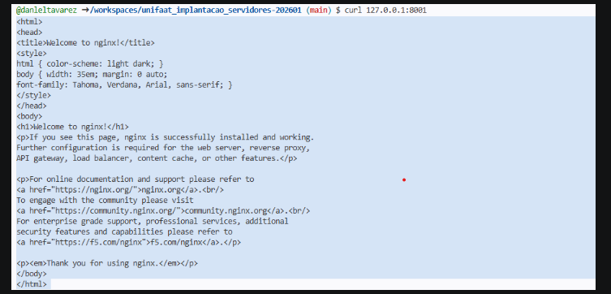
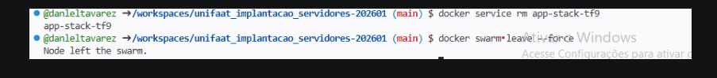
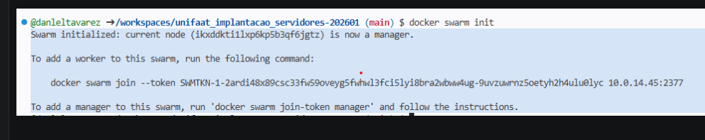
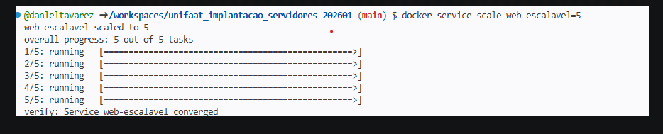

Questão 1: Conceito de Cluster (Teórica)

Compose = ambiente local e simples (1 máquina)
Swarm = ambiente distribuído e escalável (várias máquinas)

Questão 2: Funções dos Nós (Teórica)

Manager = “cérebro” (coordena e decide)
Worker = “braço” (executa os containers)

Questão 3: Inicialização do Swarm (Prática)

a) Inicializar um novo Cluster Swarm

O comando é:

##  docker swarm init

  
👉 Esse comando transforma o host atual em um Manager e inicia o cluster Swarm.

b) Driver de rede padrão no Swarm

✅ Overlay

👉 O driver overlay permite a comunicação entre containers/serviços que estão em diferentes hosts (nós) dentro do cluster, criando uma rede virtual distribuída.

Questão 4: Criação de Service (Prática)

a) Criar o Service com 3 réplicas
docker service create --name web-escalavel --replicas 3 nginx:alpine

👉 Isso cria um serviço no Swarm com 3 instâncias (réplicas) rodando a imagem do Nginx.

b) Ver o status das réplicas em tempo real
docker service ps web-escalavel

👉 Esse comando mostra:

Em qual nó cada réplica está rodando
Status (running, pending, etc.)
Se houve falhas ou reinicializações

Questão 5: Atualização e Escalabilidade (Prática)

a) Aumentar o número de réplicas
docker service scale web-escalavel=5

👉 Isso faz o Swarm subir automaticamente mais 2 instâncias para atingir as 5 réplicas desejadas.

b) Termo que descreve esse comportamento

✅ Auto-recuperação (Self-healing)

👉 O Docker Swarm mantém o estado desejado do serviço.
Se um nó falhar, ele recria automaticamente as réplicas perdidas em outros nós saudáveis do cluster.

Passo 1: Inicialização do Cluster

🔹 Limpeza do ambiente (caso já exista um Swarm ativo)

Se o nó atual já faz parte de um cluster:

docker swarm leave --force

👉 O --force é usado caso esse nó seja um Manager, forçando a saída do cluster.

🔹 Inicialização de um novo Cluster Swarm
docker swarm init

👉 Esse comando:

Cria um novo cluster
Define o host atual como Manager
Gera o token para adicionar novos nós (Workers/Managers)

Passo 2: Deploy de um Serviço

Esse comando:

Cria o service app-stack-tf9
Usa a imagem nginx:alpine
Publica a porta 8001 (cluster) → 80 (container)
Sobe 4 réplicas no Swarm

Passo 4: Escalabilidade

Passo 5: Limpeza Final

Remover o Service
docker service rm app-stack-tf9

👉 Remove completamente o serviço do cluster.

🔹 Sair do Swarm (encerrar o cluster no nó atual)
docker swarm leave --force

👉 O --force é necessário porque o nó é Manager, então ele força a saída e encerra o Swarm.

