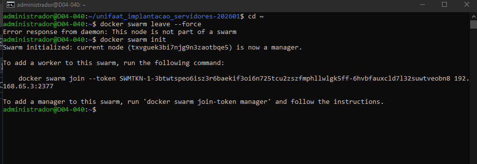
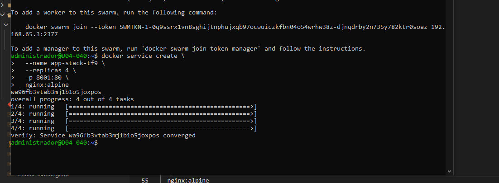
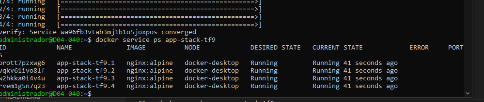
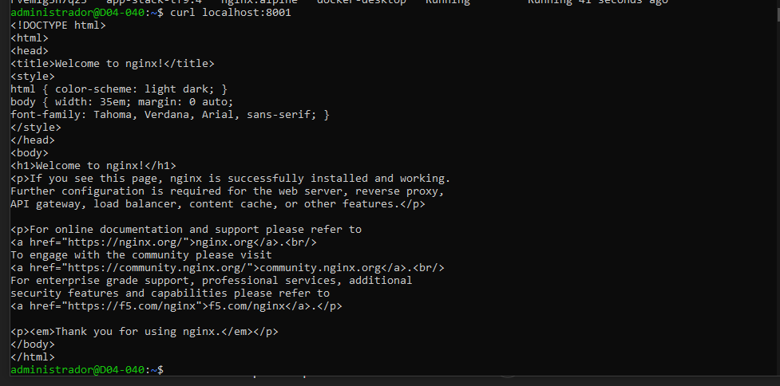
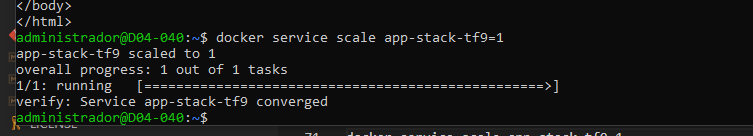
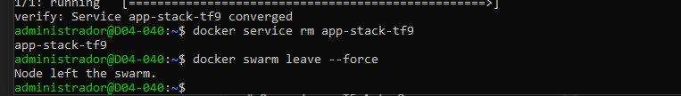

# Respostas - TF Aula 8

## Questão 1

A diferença fundamental é,
Docker Compose: gerencia containers em um único host, sem distribuição de carga ou tolerância a falhas.
Docker Swarm: gerencia serviços em um cluster de multiplos nós, permitindo escalabilidade, balanceamento de carga e alta disponibilidade.

## Questão 2

Manager:
Controla o cluster
Gerencia estado desejado, quantas replicas devem existir
Agenda containers nos nos
Mantém o controle do Swarm
Worker:
Executa as tarefas (containers)
Recebe instruções do Manager

## Questão 3

A - docker swarm init

B - Overlay

## Questão 4

A - docker service create --name web-escalavel --replicas 3 nginx:alpine

B - docker service ps web-escalavel

## Questão 5

A - docker service scale web-escalavel=5

B - Auto-healing

# Tarefa Prática Integrada

## Passo 1

Limpeza: docker swarm leave --force

Iniciar: docker swarm init

## Passo 2

Service: 
docker service create \
  --name app-stack-tf9 \
  --replicas 4 \
  -p 8001:80 \
  nginx:alpine

## Passo 3

docker service ps app-stack-tf9

curl localhost:8001

## Passo 4

docker service scale app-stack-tf9=1

## Passo 5

docker service rm app-stack-tf9

