Questão 1: Conceito de Cluster (Teórica)

A diferença fundamental está na escala e na forma de gerenciamento:

Docker Compose:
Gerencia containers em um único host (máquina).
Não possui gerenciamento distribuído.
É mais simples e usado para desenvolvimento/local.
Docker Swarm:
Gerencia containers em um cluster de múltiplos nós (máquinas).
Permite alta disponibilidade, balanceamento de carga e escalabilidade automática.
Ideal para ambientes de produção.

👉 Compose = local (1 máquina)
👉 Swarm = distribuído (várias máquinas)

Questão 2: Funções dos Nós (Teórica)

Dentro do cluster Swarm:

🔹 Manager
Controla o cluster.
Responsável por:
Orquestração dos serviços
Distribuição das tarefas
Monitoramento do estado do cluster
Decide onde cada container vai rodar.
🔹 Worker
Executa as tarefas enviadas pelo Manager.
Responsável por:
Rodar os containers (services)
Não toma decisões, apenas executa.

Questão 3: Inicialização do Swarm (Prática)

a) Comando para inicializar o cluster:
docker swarm init

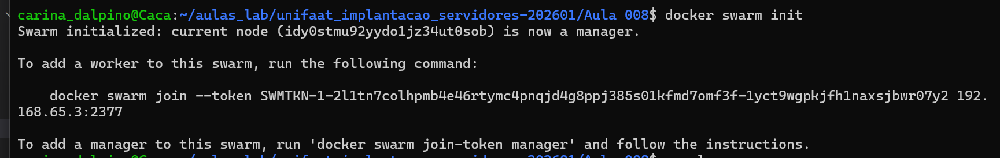

b) Driver de rede padrão:
overlay

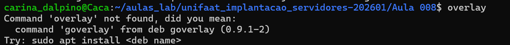

👉 Esse driver permite comunicação entre containers em diferentes nós do cluster.

Questão 4: Criação de Service (Prática)

a) Criar service com 3 réplicas:
docker service create --name web-escalavel --replicas 3 nginx:alpine

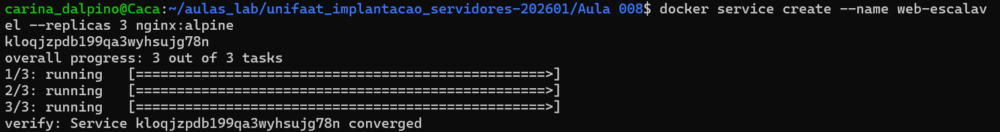

b) Ver status em tempo real:
docker service ps web-escalavel

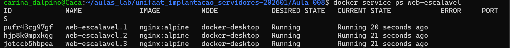

✅ Questão 5: Atualização e Escalabilidade (Prática)
a) Aumentar para 5 réplicas:
docker service scale web-escalavel=5
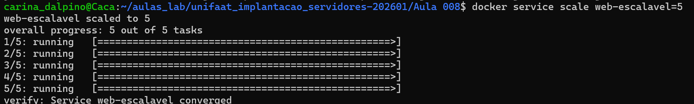

b) Nome dessa capacidade:

👉 Auto-healing (ou Self-healing)

Ou seja:

O Swarm automaticamente recria containers quando há falha.

🚀 Tarefa Prática Integrada
🔹 Passo 1: Inicialização do Cluster

Limpeza (caso já exista cluster):
docker swarm leave --force
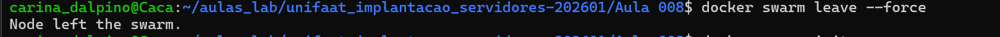

Inicializar novo cluster:
docker swarm init

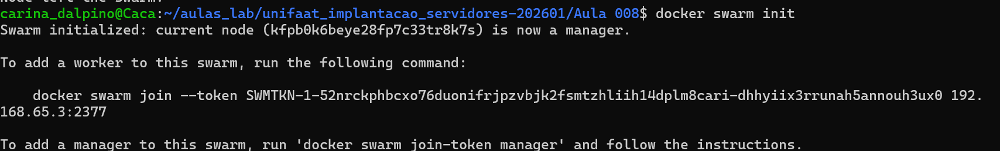

🔹 Passo 2: Deploy do Serviço
docker service create \
--name app-stack-tf9 \
--publish 8001:80 \
--replicas 4 \
nginx:alpine

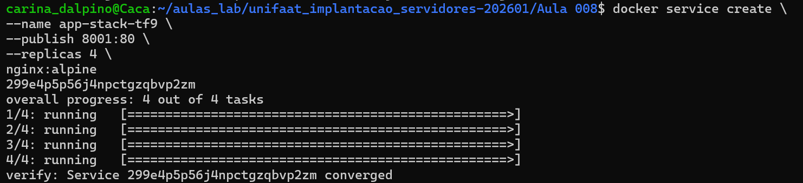

🔹 Passo 3: Validação

1. Ver status das réplicas:
docker service ps app-stack-tf9

📌 Evidência 1 (exemplo esperado):
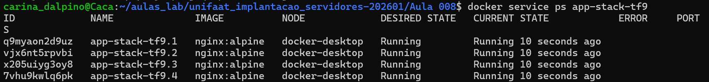
ID            NAME              IMAGE          NODE       DESIRED STATE  CURRENT STATE
xxxx          app-stack-tf9.1   nginx:alpine   node1      Running        Running
xxxx          app-stack-tf9.2   nginx:alpine   node1      Running        Running
xxxx          app-stack-tf9.3   nginx:alpine   node1      Running        Running
xxxx          app-stack-tf9.4   nginx:alpine   node1      Running        Running

2. Teste com curl:
curl localhost:8001
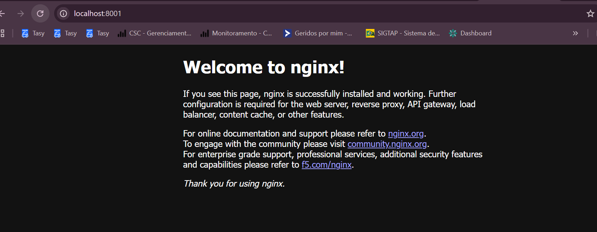

📌 Evidência 2 (exemplo esperado):
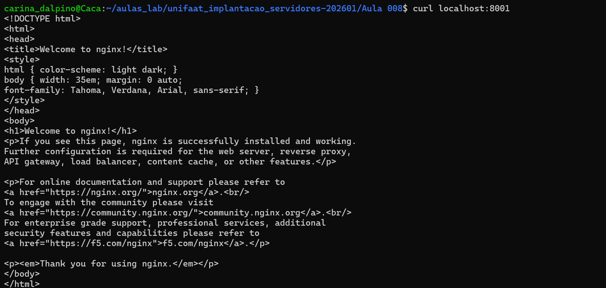

<!DOCTYPE html>
<html>
<head>
<title>Welcome to nginx!</title>
...
</html>

🔹 Passo 4: Escalabilidade (reduzir para 1)
docker service scale app-stack-tf9=1

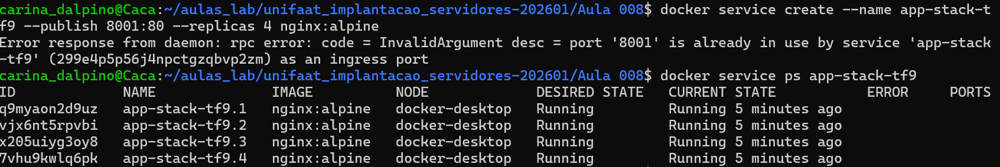

🔹 Passo 5: Limpeza Final
Remover o service:
docker service rm app-stack-tf9
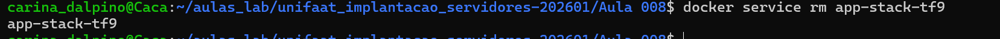

Sair do swarm:
docker swarm leave --force
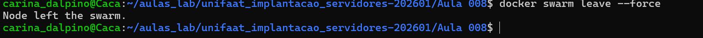