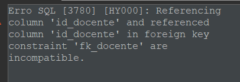
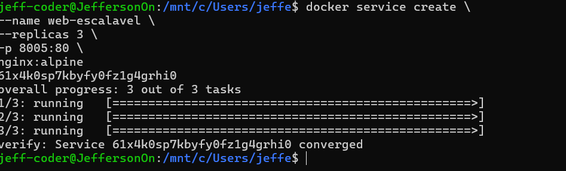
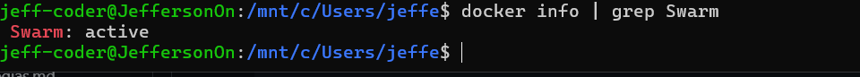
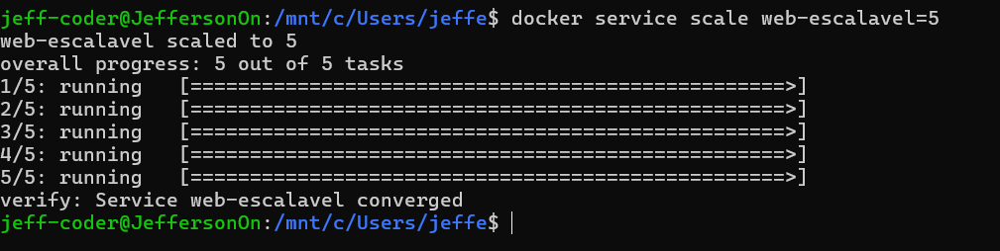

# Questão 1:
Docker-compose cria uma maquina via arquivo, onde é uma stack funcionando. Cluster é a maquina main, onde gerencia as outras maquinas, passando informações de uma para outra. Docker Swarm é essa estrutura toda, onde é usado Cluster e os "compose", as imagens e containers do compose.

# Questão 2:
**Manager**: É os comandos executados, as consultas e "regras" declaradas ao swarm
**Worker**: É a parte da execução, ele pega o que foi entregue pelo menager e coloca em pratica, cria e faz. É o sistema que fica rodando.

# Questão 3:
a)
**Iniciar o swarm com: *docker swarm init***

b)**A rede utilizada é overlay para navegar em diferentes services**

# Questão 4:
a)
**Para criar o swarm com o nome correto, porta, imagem e as 3 "copias" é usado o comando: *docker service create --name web-escalavel --replicas 3 -p 8005:80 nginx:alpine***

b)
**O comando para mostrar os status é: *docker info | grep Swarm***

# Questão 5:
a)
**Para aumentar as maquinas funcionando é o comando: *docker service scale web-escalavel=5***

b)**O nome para isso é Auto Healing, ou Self-Healing, uma auto cura das suas maquinas**

# Tarefa Prática Integrada (Obrigatória)

## Passo 1: Inicialização do Cluster

